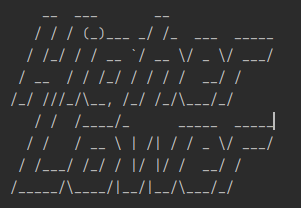

# python-higher-lower

This is a simple version of the classic **_higher lower game_**  
The classic version of the game can be played here: http://www.higherlowergame.com/  

The game asks the player to guess which instagram account has more followers.  
Player will get 1 point for each correct guess and will continue to guess between the winner from previous round and a new account.  

The game uses recursion, flags, loops and dictionaries to perform logic.  

